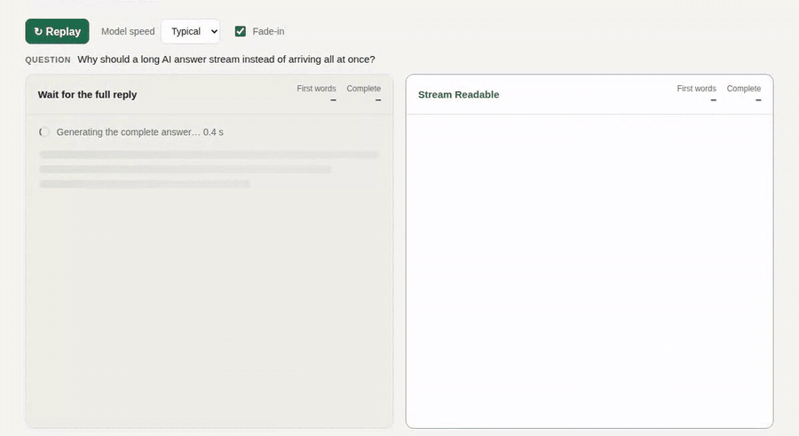

# Stream Readable

**Show AI replies while they are still being written.**

[Live demo](https://lemofyz.github.io/stream-readable/) · [中文说明](README.zh-CN.md) · `npm i stream-readable`

A long model answer can take 10 seconds or more to generate. If your UI waits for the complete response, people stare at a spinner the whole time, then get hit with a wall of text. Stream Readable renders the reply as Markdown **chunk by chunk as it arrives**, so people start reading with the first token while the rest is still being generated.



*Same synthetic chunk timeline in both panels. Left waits for the last chunk; right shows each chunk immediately.*

## Why not just re-render the Markdown string on every chunk?

That works for a demo, then breaks down on real replies:

| | Re-render whole string each chunk | Stream Readable |
|---|---|---|
| Work per chunk | Re-parses and re-renders the whole reply | Finished blocks are frozen; only the block being written is updated |
| Half-written syntax | `**bo` flashes as raw asterisks, then jumps | Renders as **bo** right away; unfinished code fences show as code |
| Already-visible text | Re-rendered on every chunk | Left alone once its block is finished |
| Fade-in effect | Hard to limit to new text | Only newly arrived characters fade in |
| Untrusted model output | Depends on the renderer (`marked` + `innerHTML` needs a sanitizer) | No `innerHTML` at all: raw HTML shows as text, only `http(s)`/`mailto` links |

Zero runtime dependencies, about 8 kB gzipped (React is a peer dependency).

## Quick start

```sh
npm i stream-readable
```

```tsx
import {useState} from 'react';
import {createTextStream, StreamingMarkdown, type StreamSession} from 'stream-readable';
import 'stream-readable/style.css';

const stream = createTextStream();

export function Answer() {
  const [session, setSession] = useState<StreamSession | null>(null);

  async function ask(question: string) {
    const s = stream.begin();          // starts a new reply; late chunks from an old one are ignored
    setSession(s);
    s.requestStarted();
    try {
      const response = await fetch('/api/chat', {method: 'POST', body: JSON.stringify({question})});
      const reader = response.body!.pipeThrough(new TextDecoderStream()).getReader();
      for (;;) {
        const {done, value} = await reader.read();
        if (done) break;
        s.append(value);               // show it now, no buffering
      }
      s.complete();
    } catch (error) {
      s.fail(error);                   // keeps the partial reply on screen
    }
  }

  return <>
    <button onClick={() => ask('Explain streaming')}>Ask</button>
    <StreamingMarkdown stream={stream} session={session} />
  </>;
}
```

Your backend has to stream too (chunked `fetch`, Server-Sent Events, WebSocket, or a provider SDK's stream). Whatever the transport, call `session.append(delta)` with each **new** piece of text. Example with Server-Sent Events:

```ts
const s = stream.begin();
s.requestStarted();
const source = new EventSource('/api/chat/stream');
source.onmessage = event => event.data === '[DONE]' ? (s.complete(), source.close()) : s.append(event.data);
source.onerror = () => { s.fail(new Error('Connection lost')); source.close(); };
```

## Features

- **Readable from the first token.** The first chunk is shown without waiting for a frame; later chunks are batched per animation frame.
- **Streaming-aware Markdown.** Headings, paragraphs, bold/italic/strikethrough, inline code, fenced code blocks, ordered/unordered/nested lists, task lists, blockquotes, tables, links, horizontal rules.
- **Optimistic rendering of unfinished syntax.** `**bo`, `` `npm i``, an open ```` ``` ```` fence, or a table header without its separator row all render as what they will become.
- **Gentle fade-in (optional).** New characters fade in left to right; visible text never replays. Turn it off with `animate={false}`. Turned off automatically for `prefers-reduced-motion`, hidden tabs, and large bursts.
- **Correct lifecycle.** Stop and errors keep the partial reply; restarting ignores stale chunks from the previous request.
- **Safe for model output.** DOM is built with `createElement`/`textContent`. Raw HTML is displayed as text. `javascript:` and other non-web links are not linked. Images are shown as links instead of auto-loading model-chosen URLs.

## API

### `createTextStream(options?)`

Creates a controller you can render with any of the components. Pass `{batch: false}` to publish every chunk immediately instead of once per frame.

| Method | |
|---|---|
| `stream.begin()` | Start a new reply and return its `session`. Older sessions become inert. |
| `stream.getSnapshot()` / `stream.subscribe(fn)` | Read the current `{text, status, ...}` and listen for changes. |
| `stream.dispose()` | Final teardown. |
| `session.requestStarted()` | Call right before you send the request (needed before `append`). |
| `session.append(delta)` | Add new text. Deltas, not the cumulative text. |
| `session.complete()` / `session.interrupt()` / `session.fail(error)` | End the reply. The text stays. |

### `<StreamingMarkdown stream session animate? label? className? />`

Renders the reply as Markdown. `animate` defaults to `true`. Default styles are in `stream-readable/style.css` and inherit your font and colors; code blocks get a `language-*` class.

### Also included

- `<StreamingText>`: plain text, one stable text node.
- `<SmoothedStreamingText>`: plain text with the same fade-in.
- `useStreamingText(stream)`: React hook returning the current snapshot.
- `parseMarkdown(text, {open})`: the parser on its own, returning a block tree (for custom renderers).
- `durations(snapshot.marks)`: optional timing (time to first text, time to visible, etc.). See [measurement notes](docs/measurement.md).

## Run the demo locally

```sh
git clone https://github.com/Lemofyz/stream-readable.git
cd stream-readable
npm ci
npm run dev        # http://127.0.0.1:4318 (demo), /lab.html (latency lab)
npm test           # unit and component tests
npm run build      # static demo in dist/
```

## Limits

Not supported: raw HTML, footnotes, math, and syntax highlighting (style `pre code.language-*` yourself). The component does not auto-scroll or virtualize very long histories; the demo shows a small auto-follow hook you can copy.

## License

MIT. Issues and pull requests are welcome.
