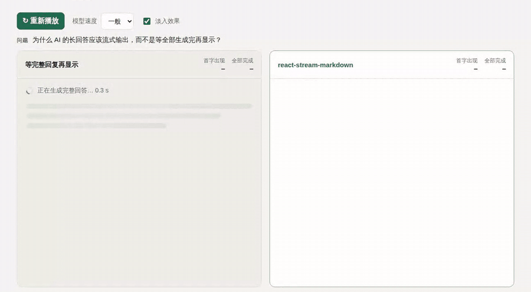

# Stream Readable

**边生成，边阅读：让 AI 的回答在生成过程中就能被看到。**

[在线演示](https://lemofyz.github.io/stream-readable/?lang=zh) · [English](README.md) · `npm i stream-readable`

一个长回答，模型往往要生成 10 秒甚至更久。如果界面等完整结果出来再显示，用户就要一直盯着加载动画，最后再一下子面对一大段文字。Stream Readable 在**每个片段到达时**就把它渲染成 Markdown，用户收到第一个 token 就能开始读，后面的内容还在继续生成。



*两个面板回放的是同一条模拟片段时间线。左边等最后一个片段，右边每个片段到达就显示。*

## 为什么不直接每来一个片段就重新渲染整段 Markdown？

做个 demo 可以，放到真实的长回答里就会出问题：

| | 每次重新渲染整段 | Stream Readable |
|---|---|---|
| 每个片段的开销 | 整段重新解析、重新渲染 | 写完的块直接冻结，只更新正在写的那一块 |
| 写到一半的语法 | `**粗` 先闪出星号，然后跳变 | 立刻显示成 **粗**；没闭合的代码块直接显示为代码 |
| 已经显示的文字 | 每个片段都重新渲染一遍 | 所在的块写完后就不再变动 |
| 淡入效果 | 很难只作用于新文字 | 只有新到的字符会淡入 |
| 不可信的模型输出 | 取决于渲染器（`marked` + `innerHTML` 需要额外清洗） | 完全不用 `innerHTML`：原始 HTML 当文本显示，只允许 `http(s)`/`mailto` 链接 |

零运行时依赖，gzip 后约 8 kB（React 为 peer 依赖）。

## 快速开始

```sh
npm i stream-readable
```

```tsx
import {useState} from 'react';
import {createTextStream, StreamingMarkdown, type StreamSession} from 'stream-readable';
import 'stream-readable/style.css';

const stream = createTextStream();

export function Answer() {
  const [session, setSession] = useState<StreamSession | null>(null);

  async function ask(question: string) {
    const s = stream.begin();          // 开始新回答；旧请求迟到的片段会被忽略
    setSession(s);
    s.requestStarted();
    try {
      const response = await fetch('/api/chat', {method: 'POST', body: JSON.stringify({question})});
      const reader = response.body!.pipeThrough(new TextDecoderStream()).getReader();
      for (;;) {
        const {done, value} = await reader.read();
        if (done) break;
        s.append(value);               // 立即显示，不做缓冲
      }
      s.complete();
    } catch (error) {
      s.fail(error);                   // 已收到的内容会保留在页面上
    }
  }

  return <>
    <button onClick={() => ask('解释一下流式输出')}>提问</button>
    <StreamingMarkdown stream={stream} session={session} />
  </>;
}
```

后端也需要流式返回（分块 `fetch`、SSE、WebSocket，或模型 SDK 的流式接口）。不管用哪种传输方式，每收到一段**新增**文本就调用一次 `session.append(delta)`。SSE 示例：

```ts
const s = stream.begin();
s.requestStarted();
const source = new EventSource('/api/chat/stream');
source.onmessage = event => event.data === '[DONE]' ? (s.complete(), source.close()) : s.append(event.data);
source.onerror = () => { s.fail(new Error('连接中断')); source.close(); };
```

## 特性

- **第一个 token 就能读。** 第一个片段不等下一帧直接显示，之后的片段按动画帧合并。
- **为流式场景设计的 Markdown。** 支持标题、段落、粗体/斜体/删除线、行内代码、代码块、有序/无序/嵌套列表、任务列表、引用、表格、链接、分隔线。
- **未写完的语法提前按最终样式渲染。** `**粗`、`` `npm i``、没闭合的 ```` ``` ````、还没有分隔行的表头，都会直接显示成它们最终的样子。
- **轻量淡入（可选）。** 新字符从左到右淡入，已显示的文字不会重播。用 `animate={false}` 关闭。在系统开启"减少动态效果"、标签页在后台、或者一次涌入大量文字时会自动关闭。
- **生命周期处理完整。** 停止和出错时保留已收到的内容；重新开始时忽略上一次请求迟到的片段。
- **对模型输出安全。** DOM 用 `createElement`/`textContent` 构建，原始 HTML 当文本显示，`javascript:` 等非网页链接不会生成链接，图片显示为链接而不是自动加载模型给出的地址。

## API

### `createTextStream(options?)`

创建一个控制器，可以交给下面任意一个组件渲染。传 `{batch: false}` 表示每个片段都立即发布，而不是每帧合并一次。

| 方法 | 说明 |
|---|---|
| `stream.begin()` | 开始新回答，返回 `session`。之前的 session 自动失效。 |
| `stream.getSnapshot()` / `stream.subscribe(fn)` | 读取当前 `{text, status, ...}`，监听变化。 |
| `stream.dispose()` | 最终销毁。 |
| `session.requestStarted()` | 发请求前调用（`append` 之前必须调用）。 |
| `session.append(delta)` | 追加新文本。传增量，不是累计全文。 |
| `session.complete()` / `session.interrupt()` / `session.fail(error)` | 结束回答，文字保留。 |

### `<StreamingMarkdown stream session animate? label? className? />`

把回答渲染为 Markdown，`animate` 默认 `true`。默认样式在 `stream-readable/style.css` 里，继承你页面的字体和颜色；代码块带 `language-*` 类名。

### 其他导出

- `<StreamingText>`：纯文本，只用一个稳定的文本节点。
- `<SmoothedStreamingText>`：纯文本 + 同样的淡入效果。
- `useStreamingText(stream)`：返回当前快照的 React hook。
- `parseMarkdown(text, {open})`：单独使用解析器，返回块结构（方便自定义渲染）。
- `durations(snapshot.marks)`：可选的耗时统计（首字时间、可见时间等），见[测量说明](docs/measurement.md)。

## 本地运行演示

```sh
git clone https://github.com/Lemofyz/stream-readable.git
cd stream-readable
npm ci
npm run dev        # http://127.0.0.1:4318（演示），/lab.html（延迟实验室）
npm test           # 单元测试和组件测试
npm run build      # 静态演示输出到 dist/
```

## 暂不支持

原始 HTML、脚注、数学公式、语法高亮（可以自己给 `pre code.language-*` 加样式）。组件不负责自动滚动，也不做超长历史的虚拟列表；演示里有一个可以直接复制的"自动跟随到底部"小 hook。

## 许可证

MIT。欢迎提 Issue 和 PR。
